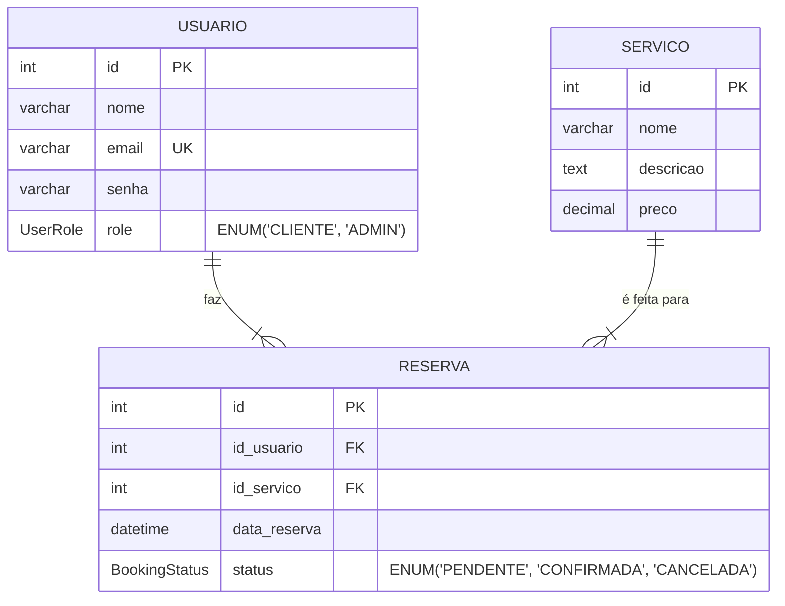

-----

# Sistema de Reservas em PHP MVC

Um projeto full-stack para um sistema de agendamento de serviços, desenvolvido com PHP orientado a objetos, padrão MVC, SQL e foco em boas práticas de desenvolvimento de software.

-----

## ✨ Tabela de Conteúdos

  * [Visão Geral](https://www.google.com/search?q=%23-vis%C3%A3o-geral)
  * [Funcionalidades](https://www.google.com/search?q=%23-funcionalidades)
  * [Tecnologias Utilizadas](https://www.google.com/search?q=%23-tecnologias-utilizadas)
  * [Arquitetura do Projeto](https://www.google.com/search?q=%23-arquitetura-do-projeto)
      * [Padrão MVC](https://www.google.com/search?q=%23padr%C3%A3o-mvc)
      * [Modelagem de Dados (ERD)](https://www.google.com/search?q=%23modelagem-de-dados-erd)
  * [🚀 Instalação e Execução](https://www.google.com/search?q=%23-instala%C3%A7%C3%A3o-e-execu%C3%A7%C3%A3o)
  * [🔑 Credenciais de Acesso](https://www.google.com/search?q=%23-credenciais-de-acesso)
  * [Licença](https://www.google.com/search?q=%23-licen%C3%A7a)

-----

## 📖 Visão Geral

Este projeto simula um portal de reservas onde clientes podem se cadastrar, agendar serviços e acompanhar o status de seus agendamentos. Um painel administrativo permite o gerenciamento completo de todas as reservas cadastradas no sistema. O principal objetivo foi construir uma aplicação funcional, segura e bem estruturada, aplicando conceitos modernos de desenvolvimento PHP.

-----

## ⚙️ Funcionalidades

### Painel do Cliente

  * ✅ Cadastro e Login de usuários.
  * ✅ Visualização dos serviços disponíveis.
  * ✅ Criação de novas reservas para um serviço em uma data e hora específicas.
  * ✅ Página para visualizar o status de todas as suas reservas (Pendente, Confirmada, Cancelada).

### Painel do Administrador

  * 🔒 Acesso restrito para usuários com perfil de `ADMIN`.
  * 📊 Dashboard com a listagem de **todas** as reservas de **todos** os clientes.
  * ✏️ Funcionalidade para alterar o status de qualquer reserva.

-----

## 🛠️ Tecnologias Utilizadas

  * **Backend:** PHP 8.1+
  * **Banco de Dados:** MySQL / MariaDB
  * **Gerenciador de Dependências:** Composer
  * **Bibliotecas PHP:**
      * `vlucas/phpdotenv` - Para gerenciamento de variáveis de ambiente.
  * **Frontend:**
      * HTML5
      * CSS3
      * Bootstrap 5

-----

## 🏗️ Arquitetura do Projeto

A aplicação foi estruturada com base em princípios sólidos de engenharia de software para garantir clareza, manutenibilidade e separação de responsabilidades.

### Padrão MVC (Model-View-Controller)

  * **Model:** Camada responsável pela lógica de negócio e interação com o banco de dados. (Local: `app/Models`)
  * **View:** Camada de apresentação, contendo o código HTML e a exibição dos dados. (Local: `app/Views`)
  * **Controller:** Camada que recebe as requisições, orquestra a interação entre Models e Views. (Local: `app/Controllers`)

### Boas Práticas e Conceitos Aplicados

  * **Front Controller:** Todas as requisições são direcionadas para um único ponto de entrada (`public/index.php`), aumentando a segurança e o controle.
  * **Programação Orientada a Objetos (POO):** Uso consistente de classes, objetos, herança e encapsulamento.
  * **Autoload PSR-4:** Carregamento automático de classes gerenciado pelo Composer.
  * **Enumerações:** Utilização de Enums do PHP 8.1+ para tipos de dados como `UserRole` e `BookingStatus`, tornando o código mais robusto e legível.
  * **Gerenciamento de Erros:** Um tratador de exceções global captura erros e exibe uma página amigável, evitando a exposição de detalhes técnicos para o usuário final.
  * **Segurança:** Senhas são armazenadas com hash (`password_hash`) e a comunicação com o banco de dados é feita via PDO para prevenir SQL Injection.

### Modelagem de Dados (ERD)



-----

## 🚀 Instalação e Execução

Siga os passos abaixo para executar o projeto localmente.

### Pré-requisitos

  * PHP 8.1 ou superior
  * Composer
  * MySQL (ou MariaDB)
  * Git

### Passos

1.  **Clone o repositório:**

    ```bash
    git clone https://github.com/seu-usuario/sistema-reservas.git
    ```

2.  **Navegue até a pasta do projeto:**

    ```bash
    cd sistema-reservas
    ```

3.  **Instale as dependências do PHP:**

    ```bash
    composer install
    ```

4.  **Configure o ambiente:**

      * Copie o arquivo de exemplo `.env.example` para um novo arquivo chamado `.env`.
        ```bash
        cp .env.example .env
        ```
      * Abra o arquivo `.env` e **edite as credenciais do banco de dados** (`DB_HOST`, `DB_DATABASE`, `DB_USERNAME`, `DB_PASSWORD`) para corresponder à sua configuração local.

5.  **Crie o banco de dados e as tabelas:**

      * Crie um banco de dados no seu MySQL com o nome que você definiu em `DB_DATABASE`.
      * Importe o arquivo `database.sql` (contendo a estrutura das tabelas e os dados iniciais) para o seu banco de dados.

6.  **Inicie o servidor local do PHP:**

    ```bash
    php -S localhost:8000 -t public
    ```

      * Este comando inicia um servidor na porta `8000`, usando a pasta `public` como diretório raiz.

7.  **Acesse a aplicação:**

      * Abra seu navegador e acesse: `http://localhost:8000`

-----

## 🔑 Credenciais de Acesso

Para acessar o painel administrativo, utilize as seguintes credenciais padrão:

  * **Email:** `admin@email.com`
  * **Senha:** `admin123`

-----

## 📄 Licença

Este projeto está sob a licença MIT. Veja o arquivo [LICENSE](https://www.google.com/search?q=LICENSE) para mais detalhes.

-----
